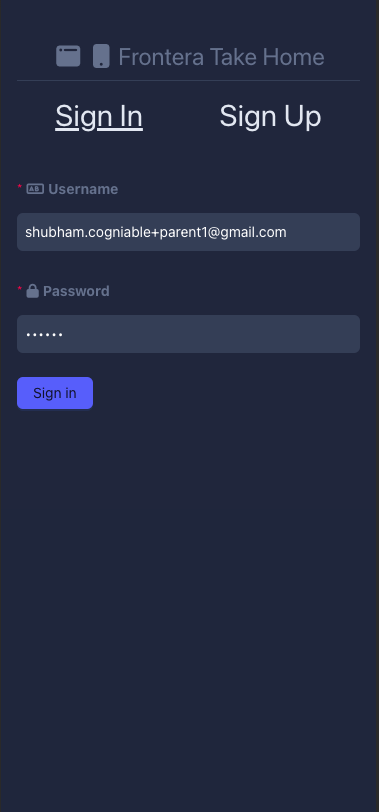
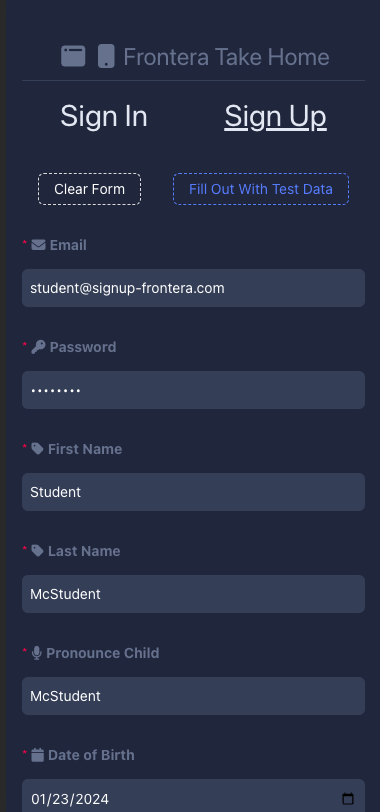
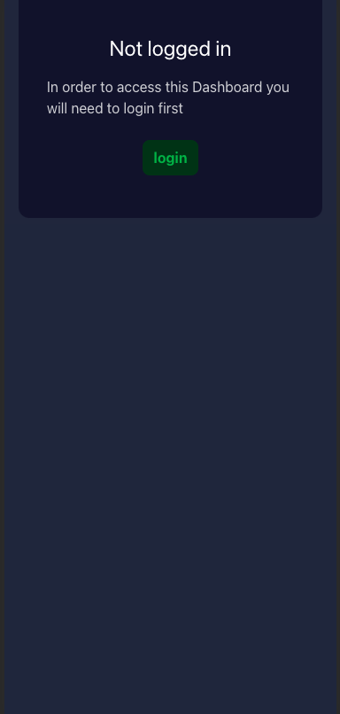
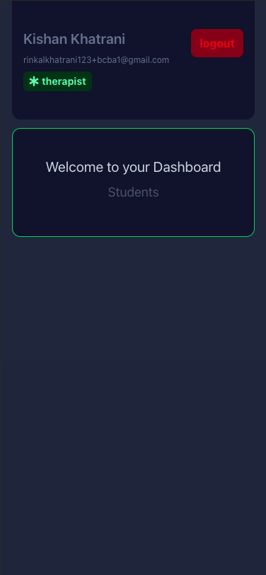
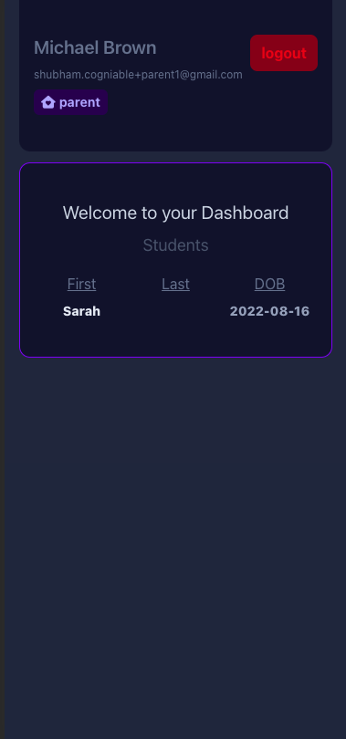

# Frontera Take Home Assignment

<p float="left">





</p>

## ⭐️🔗 [Live UI Link](https://frontera-takehome-alex-tzinov.netlify.app/auth)

#### Table of Contents

[How To Run](#how-to-run)  
[The Approach and Decisions Made](#the-approach-and-the-decisions-made)  
[Tasks Addressed](#tasks-addressed)

## How To Run

```bash
git clone git@github.com:Tzinov15/frontera-take-home.git
cd frontera-take-home/fe
yarn install # install all project dependencies
yarn start # run web server serving SPA, generate types

# navigate to localhost:3000

# or see live app link above
```

## The Approach and Decisions Made

When I started this assignment, I had the goal of approaching it not just as a take-home assignment but as a project that would necessitate the kind of planning and forethought that starting a production scale, web app from scratch would. I wanted to show the kind of research, weighing of options, and diving into industry best practices I would do when on the actual job as well. I thus looked at a few key areas of building a web app and dove into several hours of research and prototyping to see what industry best practices are today. I have broken down these areas below, but they are:

- **`Global State Mangement Tools`**
- **`Design Systems / Component Libraries / CSS Solutions`**

### Global State Management Tools

When I saw the mention of Redux and Redux Saga, the first thoughts that popped into my head were flashbacks of extensive boiler plate, lots of middleware, several layers of abstraction that introduced a lot of moving pieces, and a lot of overheard to extend and add functionality. I was very curious to dive into the world of state management and understand where industry standards had come today and what other (if any) approaches existed. Again, I approached this assignment through the lens of "If we were to start building a production-ready web app with the best practices of today, what should be included and how can I make the case for that?"

Amidst my research and experience I have come to understand **UI application state** as falling into 3 buckets:

- `Local State` - this is state localized to a specific UI component and doesn't exist outside (ie: a form input, toggle state, animated mouseover state, etc). This is often as simply as a simple `useState()` call in React and can be better managed in the spirit of Redux / Flux architecture with a `useReducer()` hook
- `Global Client Only State` - this is state that is necessary to have globally accessible to several components at various depths of the component tree (ie: global theming settings, open/close modal that needs to be opened from several places, scroll position that is getting persisted across tabs, which tab the user might be on, etc). This kind of state benefits from being managed centrally and not needing to be prop drilled, a problem that both Redux and other solutions _can_ solve (eg: using React Context + useReducer)
- `Server / Database State` - this is state that exists on the UI and is effectively a cache for the database / backend. This is where the business logic of the app usually resides. The end user can _view_ their persisted saved state (view their appointments, view their historical progress, view their posts, etc) and _modify_ their persisted save state (register a new account, book a new appointment, etc).

  This kind of state is unique from client-only state in several in its aspects, including the repeated `idle` | `fetching` | `success` | `error` states that each request for data can be in, the problems of invalidating caches and knowing when to re-request data, and insuring that the state between the backend and the state on the UI is kept in sync (when you make a POST request that will take a long time do you optimistically update the UI? Do you refetch data every time the user mounts a component or only when the app mounts? Do you store fetched data in localStorage?)

  All of these unique aspects to managing Server / Database / (Business Logic) State and separating this kind of state from client-only state moved me towards a library uniquely designed to solve it. [React Query (now known as TanStack Query)](https://tanstack.com/query/v4/docs/react/overview). It is one of the faster growing React libraries and I immediately found that it abstracted all of the difficult aspects mentioned above. Since this assignment predominately deals with Server state (User Login, User Signup, User Details) I decided that adopting TanStack Query would be a much faster, much more elegant, and much cleaner solution to managing async server state than setting up an entire Redux + Redux Saga solution.

  I recognize the assignment mentioned Redux & Redux Saga and I am open to discussing my thought process. I emphasized the "for statement management and async operations" portion of the assignment and found the most elegant code path towards that.

### Design Systems / Component Libraries / CSS Solutions

I decided to adopt a CSS framework that I haven't largely used before but have heard positive things about, in particular with regards to aiding fast prototyping. [TailwindCSS](https://tailwindcss.com/) is an AtomicCSS library where styling happens through utility classes, much like Bootstrap back in the day (ie: `mx-4`, `text-align-center`, `bg-color-green-500`, `width-full`, etc).

While my desired longer term solution would be a dedicated component library, TailwindCSS allowed me to very quickly build up interfaces that got the job done. I also pulled in the ANT Components from their design system, although used them sparingly since I found myself faster at prototyping components on the fly with Tailwind than understanding the various configurations of ANT. As a UI developer that thrives on having intimate control over styling / layout and also with limited time on the project, I found myself most productive using Tailwind

What I do believe is a best practice that I would like to adopt is to almost immediately at the onset of a new web project standup an internal UI components library. What this means is that even if 80% of a first pass of a UI is simply wrapping an existing component library (MaterialUI, Ant, etc), we would still create our own components that simply wrap the underlying Button, Dropdown, or Inputs that the library exposes. (See my usage of `InputLabel.tsx` for an example) This allows us to use our "custom components" all over our application and then eventually, should we make the decision to shift off a 3rd party library and roll our own, this lift will be much easier since we can just swap out the underlying implementation of our custom component in a single location vs. every usage of the component across the app.

## Tasks Addressed

- "Setup the redux and redux saga for state management and async operations."  
  See above explanation for leveraging React Context and TanstackQuery vs. Redux & Redux Saga for building out a scalable solution
- "Implement user authentication functionality, including registration, login, and logout (mobile responsive and you can use ant design library)."  
   All three of these functionalities are currently supported. I was unable to find a logout mutation that would revoke sessions on the server side so the UI only solution for this was to wipe the JWT from memory that is used to make authenticated requests and redirect the user to the login page
- "Ensure the protected routes can only be accessed by authenticated users."  
  A user is re-routed upon login to the correct sub path (`/dashboard/parents` and `/dashboard/therapist`) based on their role. If a user navigates directly to one of these routes and does not possess the correct role, they will get an error message. If the user has not logged in, they will be directed to the login page
- "Create a dashboard and show the authenticated user info."  
  Upon logging in the user gets a dashboard that contains their personal info as well as their students info when applicable
- "There are two different types of logins we have provided to redirect users to different screens according to the user type."  
  There is currently a TherapistDashboard and a ParentDashboard that are themed differently and are setup to render unique information
- ⚠️ "If the user refreshes the page or closes the tab and if the user is already logged in then redirect the user to the dashboard."

  This was the only requirement that I did not complete. I both ran out of time, and also upon doing research I discovered that storing JWTs in localStorage is considered a pretty insecure practice since running javascript on the page can pull these values. I would be curious to research more ways to achieve this with just JWTs and not changing a backend. Initial research showed that a more secure way to persist sessions seems to be via setting cookies that include the JWT and using those cookies to re-authenticate subsequent requests. With another half day, I would be able to implement a localStorage sync for the token that comes following a signin if that is part of the assignment that is still desired.
